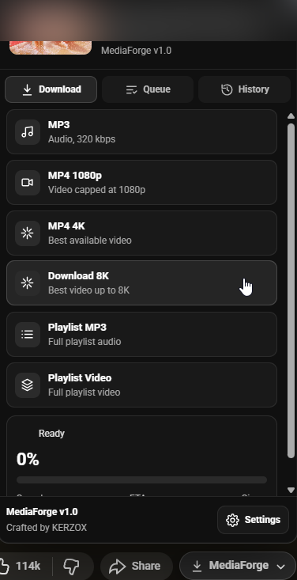
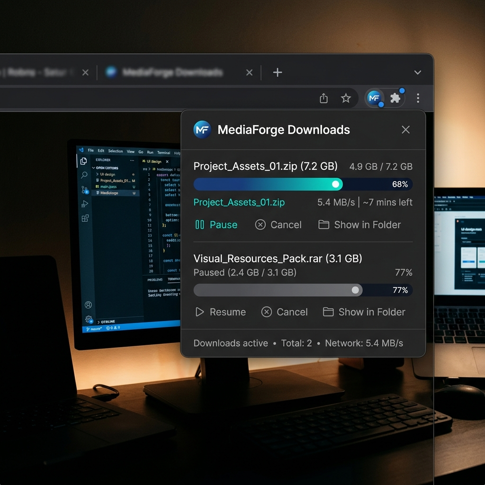
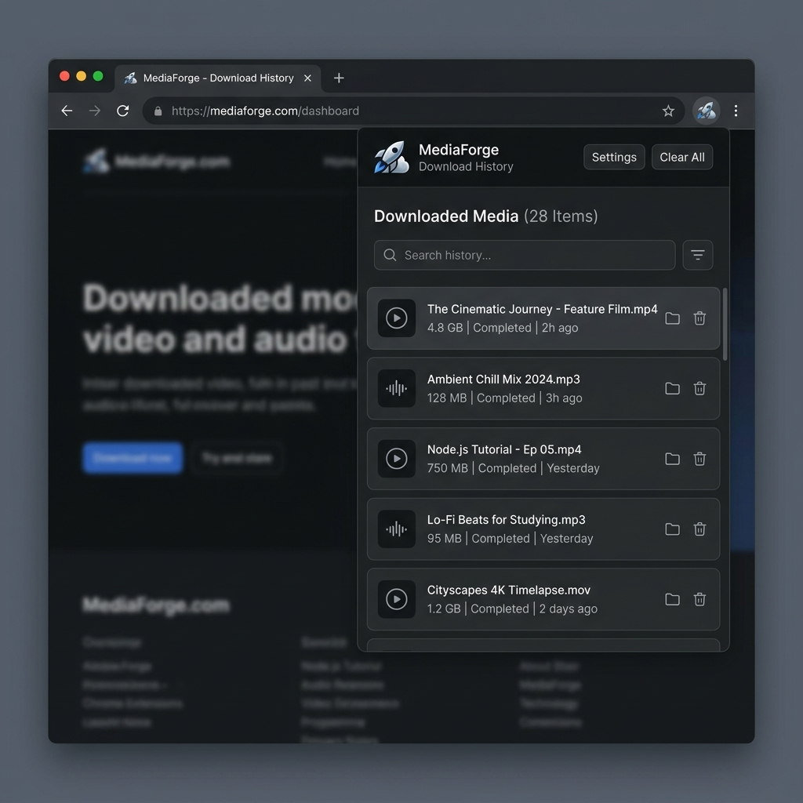
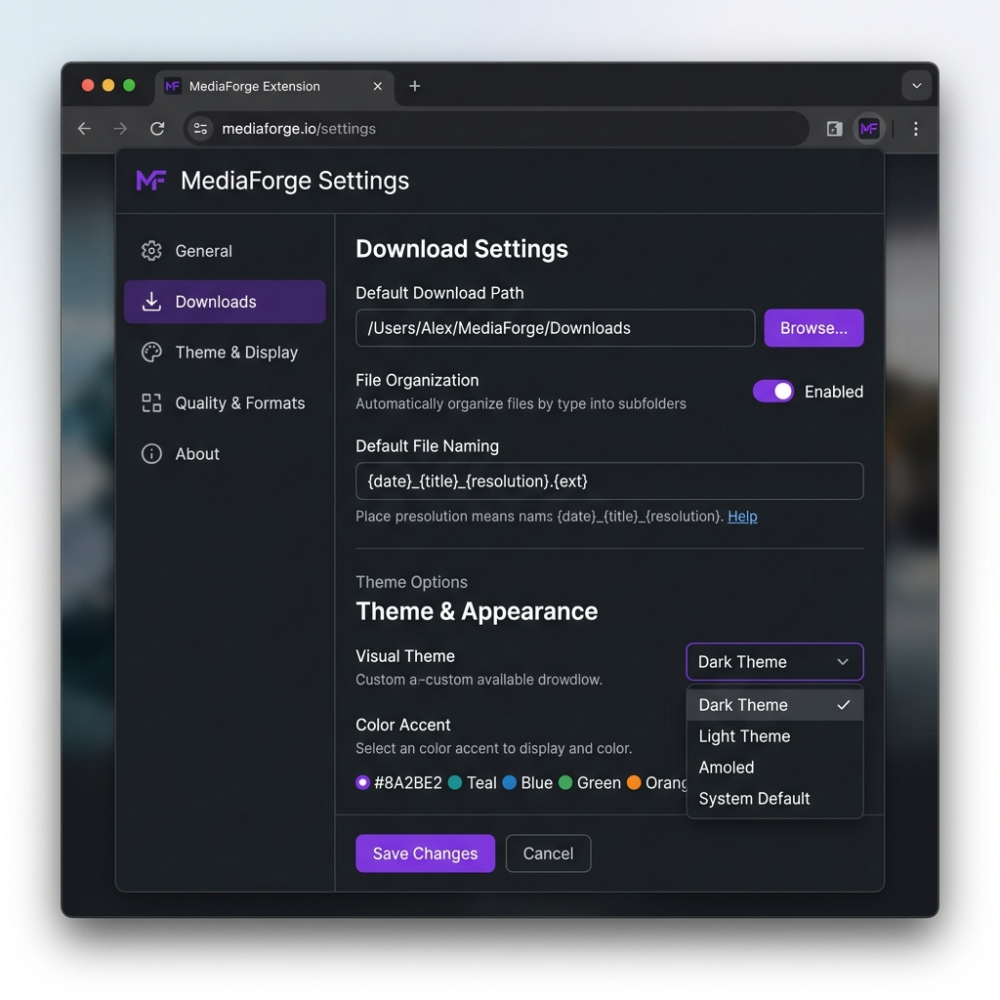

# MediaForge

<p align="left">
  <a href="https://github.com/kronpatel/MediaForge/releases"></a>
  <a href="LICENSE"></a>
  <a href="https://www.python.org/"></a>
  <a href="CONTRIBUTING.md"></a>
  
</p>

Fast, modern, and powerful media downloader with support for MP3, 1080p, 4K, 8K, playlist downloads, download history management, and a clean browser extension interface.

---

## Quick Start (TL;DR)

Get up and running in 3 minutes:

1. **Install requirements**:
   ```bash
   pip install -r backend/requirements.txt
   ```
2. **Add FFmpeg binaries**: Download `ffmpeg.exe` and `ffprobe.exe` from [Gyan.dev](https://www.gyan.dev/ffmpeg/builds/) (Windows) or [FFmpeg](https://ffmpeg.org/download.html) and place them inside the `ffmpeg/` directory at the project root.
3. **Run the backend & load extension**: Double-click `MediaForge Backend.bat` (Windows) or execute `python backend/app.py`, then load the `extension/` directory as an unpacked extension at `chrome://extensions/` in your browser.

---

## Features

- **MP3 Downloads** (High quality 320kbps audio extraction)
- **1080p Video Downloads**
- **4K Video Downloads**
- **8K Video Downloads** with automatic fallback if 8K is not available
- **Playlist Downloads** (Full playlist video/audio extraction)
- **Download History** to track past downloads
- **Clear History** options
- **Modern UI** with dark, midnight, and high contrast themes
- **FFmpeg Integration** for seamless post-processing and merging
- **yt-dlp Powered** for fast, reliable, and up-to-date video extraction

---

## Recent Improvements (v1.1.0)

- **Backend Stability**: Enhanced active download job lifecycle and error handling, including graceful fallback when graphical environments (like Tkinter) are missing.
- **Thread Safety**: Added thread-safe synchronization to track and manage active download job transitions securely.
- **Extension Reliability**: Injected namespace guards and event listener cleanup to prevent duplicate execution paths and duplicate button injection on YouTube SPA navigation.
- **Robust Polling**: Engineered resilient polling recovery with automatic retry logic to handle transient backend connection drops without UI crashes.
- **Lifecycle Optimization**: Improved memory/CPU usage by automatically disconnecting `MutationObserver` instances and cleaning up timers on page transitions.
- **Performance Enhancement**: Consolidated panel data fetch requests and eliminated redundant layout calculations.
- **Settings & History Integrity**: Refined the settings loader to protect user configurations from being overwritten, and implemented an in-memory cache for download history with automatic file modification timestamp validation.
- **Notification Compatibility**: Migrated extension notifications to use the standard PNG format to ensure cross-platform compatibility.

---

## Requirements

Before running MediaForge, ensure you have the following installed:

1. **Python 3.8+**
2. **FFmpeg** (See setup instructions below)
3. **Google Chrome / Chromium-based Browser** (Microsoft Edge, Brave, Opera, etc.)

---

## Directory Structure

For everything to run smoothly, ensure your folder structure looks like this:

```text
MediaForge/
├── backend/
│   ├── app.py
│   ├── downloader.py
│   └── requirements.txt
├── extension/
│   ├── manifest.json
│   ├── content.js
│   └── ...
├── ffmpeg/             <-- Download and place FFmpeg binaries here
│   ├── ffmpeg.exe
│   └── ffprobe.exe
└── MediaForge Backend.bat
```

---

## Installation & Setup

### 1. Backend Setup

Open a terminal at the project root and navigate to the `backend/` directory:

```bash
cd backend
```

Create a virtual environment (optional but recommended):

```bash
python -m venv .venv
```

Activate the virtual environment:
* **Windows**: `.venv\Scripts\activate`
* **macOS/Linux**: `source .venv/bin/activate`

Install the required packages:

```bash
pip install -r requirements.txt
```

### 2. FFmpeg Setup

Since FFmpeg binaries are too large for Git/GitHub, you must obtain them manually:

1. Download the static FFmpeg build for your operating system:
   - Recommended source: [FFmpeg official website](https://ffmpeg.org/download.html) or [Gyan.dev (Windows)](https://www.gyan.dev/ffmpeg/builds/).
2. Extract the archive and copy `ffmpeg.exe` and `ffprobe.exe`.
3. Create a folder named `ffmpeg` at the root of the project (parent folder of `backend`).
4. Paste `ffmpeg.exe` and `ffprobe.exe` directly inside that `ffmpeg/` directory.

*Note: The backend is programmed to dynamically resolve FFmpeg inside `Project Root/ffmpeg` so it works out-of-the-box.*

### 3. Extension Installation

1. Open your Chromium-based browser (e.g., Google Chrome).
2. Navigate to `chrome://extensions/`.
3. Enable **Developer mode** using the toggle switch in the top-right corner.
4. Click **Load unpacked** in the top-left corner.
5. Select the `extension` folder inside the MediaForge project directory.

---

## Usage Instructions

1. **Start the Backend**:
   - Double-click the `MediaForge Backend.bat` file in the project root, OR run:
     ```bash
     cd backend
     python app.py
     ```
   - This starts the local server at `http://127.0.0.1:5000`.

2. **Download Media**:
   - Navigate to any YouTube video, short, or playlist.
   - Click the floating **MediaForge** button below the video title.
   - Choose your preferred download option (MP3, 1080p, 4K, 8K, or playlist).
   - Track progress, queue state, and history directly inside the extension popup UI.

3. **Configure Settings**:
   - Click the **Settings** gear icon in the footer of the extension popup.
   - Set custom download folders or select a theme (Dark, Midnight, High Contrast).

---

## Screenshots

<div align="center">
  <h3>Extension Popup Interface</h3>
  
  
  
</div>

<br>

<div align="center">
  <h3>Widescreen Options & Settings</h3>
  
</div>

---

## Roadmap

Future Features:
* **Open Download Folder**: Directly open the destination downloads folder from the UI.
* **Delete Single History Entry**: Individually clean up download records from history.
* **Download Scheduler**: Plan and schedule downloads for off-peak hours.
* **More Media Sources**: Support for downloading from platforms outside of YouTube.
* **Theme Customization**: Fully custom accent color pickers.

---

## Support & Community

* **Troubleshooting:** Make sure the local Flask backend is running (`python backend/app.py`) and that FFmpeg is located in `Project Root/ffmpeg` if you experience any merge or extraction errors.
* **Contributions:** We welcome pull requests! Check out our [Contributing Guidelines](CONTRIBUTING.md) to get started.
* **Security:** Report any vulnerabilities confidentially by following our [Security Policy](SECURITY.md).
* **Issues:** Open a ticket on the [GitHub Issues tracker](https://github.com/kronpatel/MediaForge/issues) for bug reports and enhancements.

---

## License

This project is licensed under the MIT License - see the [LICENSE](LICENSE) file for details.

---

*Crafted by **KERZOX***
