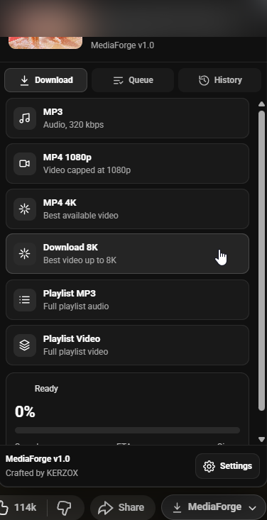
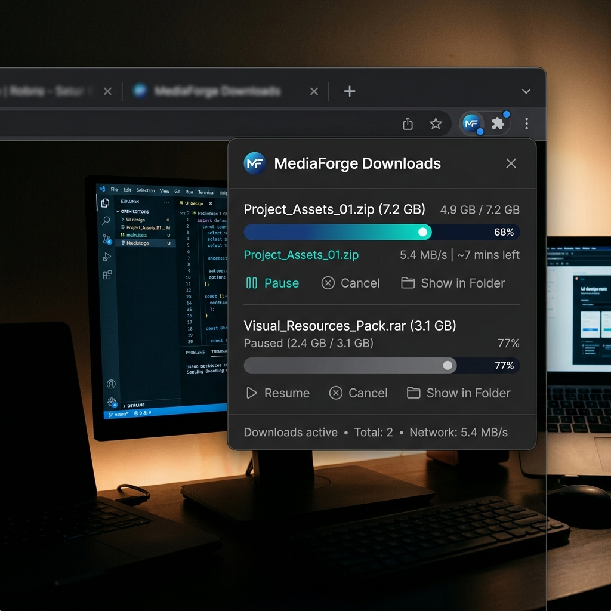
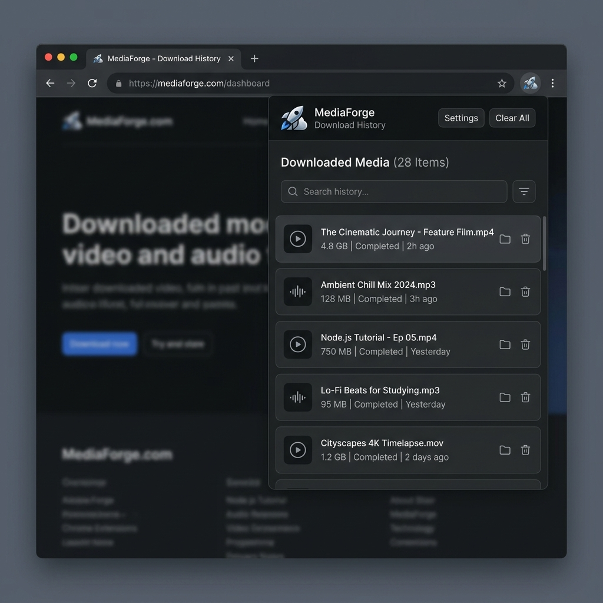
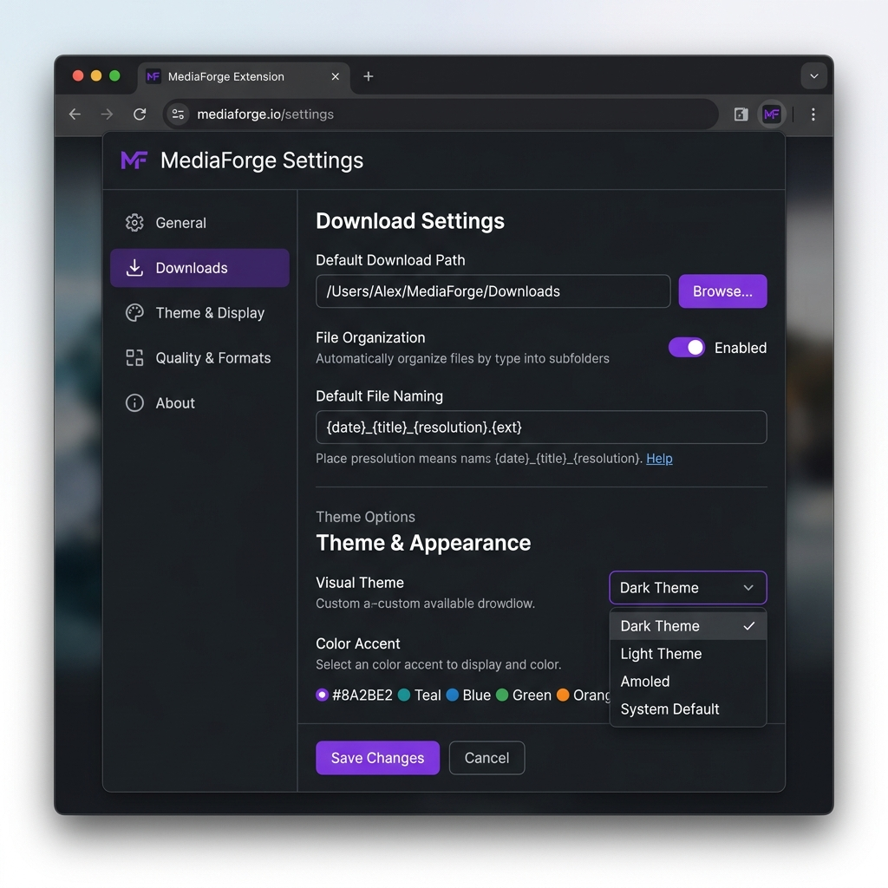

# MediaForge

<p align="left">
  <a href="https://github.com/kronpatel/MediaForge/actions"></a>
  <a href="https://www.python.org/"></a>
  <a href="LICENSE"></a>
  <a href="https://github.com/kronpatel/MediaForge/releases"></a>
  <a href="https://github.com/kronpatel/MediaForge/releases"></a>
  
</p>

Fast, modern, and powerful media downloader with support for MP3, 1080p, 4K, 8K, playlist downloads, download history management, and a clean browser extension interface.

---

## Quick Start (TL;DR)

Get up and running in 3 minutes:

1.  **Install requirements**:
    ```bash
    pip install -r backend/requirements.txt
    pip install -r companion/requirements.txt
    ```
2.  **Add FFmpeg binaries**: Download `ffmpeg.exe` and `ffprobe.exe` from [Gyan.dev](https://www.gyan.dev/ffmpeg/builds/) (Windows) or [FFmpeg](https://ffmpeg.org/download.html) and place them inside the `ffmpeg/` directory at the project root.
3.  **Run the backend & load extension**: Double-click `MediaForge Backend.bat` (Windows) or execute `python backend/app.py`, then load the `extension/` directory as an unpacked extension at `chrome://extensions/` in your browser.

---

## Features

*   **MP3 Downloads** (High quality 320kbps audio extraction)
*   **1080p Video Downloads**
*   **4K Video Downloads**
*   **8K Video Downloads** with automatic fallback if 8K is not available
*   **Playlist Downloads** (Full playlist video/audio extraction)
*   **Download History** to track past downloads
*   **Clear History** options
*   **Modern UI** with dark, midnight, and high contrast themes
*   **FFmpeg Integration** for seamless post-processing and merging
*   **yt-dlp Powered** for fast, reliable, and up-to-date video extraction

---

## Recent Improvements (v1.2.3)

*   **Auto Updater**: Background updates manager with releases checks, version comparison, download cancellation, integrity checks, and update notifications.
*   **Installer Engine**: Robust setup installer execution with automatic recovery, admin privileges elevation, process locks checks, and diagnostic reporting.
*   **Scheduler**: Full-featured task scheduler engine supporting job CRUD operations, next-run calculations, event notifications, database persistence, clock jump recovery, and schema migrations.
*   **Dashboard Improvements**: Polished widescreen tray options interface, integrated with system tray icon, tabbed pages, and live indicators.
*   **Startup Optimization**: Background services launch sequence refinement with optimized resource allocations.
*   **Notification Manager**: Priority-based notifications scheduler with quiet hours support, singleton daemon thread, history storage, and toast notifications.
*   **Queue UX Improvements**: Re-engineered active downloads layout with smooth transitions, pausing, keyboard hooks, context menus, and scroll position recovery.
*   **Engineering Hardening**: Implemented RLock thread synchronization locks on shared states, atomic file saves, and multi-layer crash handling.
*   **GitHub Actions CI**: Configured automated continuous integration pipeline verifying compile status and running the complete automated unit test suite on Windows runners under Python 3.10–3.13.
*   **Release Checklist**: Standardized verification guidelines covering tests, manual execution steps, tag rules, and staging deployment.

---

## Requirements

Before running MediaForge, ensure you have the following installed:

1.  **Python 3.10+**
2.  **FFmpeg** (See setup instructions below)
3.  **Google Chrome / Chromium-based Browser** (Microsoft Edge, Brave, Opera, etc.)

---

## Directory Structure

For everything to run smoothly, ensure your folder structure looks like this:

```text
MediaForge/
├── backend/            # Python Flask backend
│   ├── app.py          # Main backend API router
│   ├── downloader.py   # Downloader interface wrapping yt-dlp & FFmpeg
│   ├── queue_state.json  # Persistent queue state (auto-created, see below)
│   └── requirements.txt
├── companion/          # Desktop companion application (Windows)
│   ├── main.py         # Entry point for Companion System Tray app
├── extension/          # Chromium browser extension
│   ├── manifest.json
│   ├── content.js      # Floating button injection script
│   └── ...
├── ffmpeg/             # Download and place FFmpeg binaries here
│   ├── ffmpeg.exe
│   └── ffprobe.exe
└── MediaForge Backend.bat
```

### Queue State File (`backend/queue_state.json`)

The download queue is persisted to `backend/queue_state.json` with atomic writes and crash recovery:

- **Auto-created** on first save — no manual setup required.
- **Recreated if deleted** — the file is regenerated from the in-memory queue state on the next save.
- **Corruption recovery** — if a corrupt state file is detected on startup, it is renamed to `backend/.queue_state.json.corrupt` and the queue starts fresh. No data is deleted, allowing manual inspection.
- **Schema versioned** — contains `schema_version: 1` for forward compatibility with future migrations.

### Startup Recovery Flow

On every application start, the recovery manager runs automatically before accepting new downloads:

```text
Application Start
       │
       ▼
  recover_queue()
       │
       ├── 1. Restore persisted queue state
       ├── 2. Recover interrupted jobs (moves active→queued)
       ├── 3. Clean orphaned temp files (.part, .tmp)
       ├── 4. Validate and deduplicate download history
       │
       ▼
  Ready to accept new downloads
```

Interrupted jobs (in `STARTING`, `DOWNLOADING`, `PAUSED`, or `RECOVERING` state at the time of crash) are automatically re-queued and eligible for retry.

---

## Companion Application

The **MediaForge Companion Application** runs silently in the Windows system tray and acts as a background daemon to manage system-level features that browser extensions cannot perform natively:

*   **Task Scheduler**: Automatically checks and executes scheduled downloads, restoring missed tasks after system reboots.
*   **Notification Manager**: Enqueues desktop notifications, respects custom quiet hours settings, prevents duplicates, and keeps an active local logs history.
*   **Self-Updater & Installer**: Background polling check for GitHub releases, checksum verification, secure update downloading, and clean app hot-reloading via portable ZIP workflow.
*   **System Tray Control**: Quick access to options panels, active logs view, download status indicators, and clean shutdown bindings.

---

## Installation & Setup

### 1. Backend Setup

Open a terminal at the project root and navigate to the `backend/` directory:

```bash
cd backend
```

Create a virtual environment (optional but recommended):

```bash
python -m venv .venv
```

Activate the virtual environment:
*   **Windows**: `.venv\Scripts\activate`
*   **macOS/Linux**: `source .venv/bin/activate`

Install the required packages:

```bash
pip install -r requirements.txt
```

### 2. FFmpeg Setup

Since FFmpeg binaries are too large for Git/GitHub, you must obtain them manually:

1.  Download the static FFmpeg build for your operating system:
    *   Recommended source: [FFmpeg official website](https://ffmpeg.org/download.html) or [Gyan.dev (Windows)](https://www.gyan.dev/ffmpeg/builds/).
2.  Extract the archive and copy `ffmpeg.exe` and `ffprobe.exe`.
3.  Create a folder named `ffmpeg` at the root of the project (parent folder of `backend`).
4.  Paste `ffmpeg.exe` and `ffprobe.exe` directly inside that `ffmpeg/` directory.

*Note: The backend is programmed to dynamically resolve FFmpeg inside `Project Root/ffmpeg` so it works out-of-the-box.*

### 3. Extension Installation

1.  Open your Chromium-based browser (e.g., Google Chrome).
2.  Navigate to `chrome://extensions/`.
3.  Enable **Developer mode** using the toggle switch in the top-right corner.
4.  Click **Load unpacked** in the top-left corner.
5.  Select the `extension` folder inside the MediaForge project directory.

---

## Downloads

You can download the latest production releases from the [GitHub Releases](https://github.com/kronpatel/MediaForge/releases) page:

*   **Windows Setup Installer (`MediaForge-Setup.exe`)**: Recommended for standard desktop setups. Installs the application to your local user directory.
*   **Portable ZIP Edition (`MediaForge_Portable.zip`)**: A standalone edition that runs without installation and keeps all user configurations self-contained.

### Windows Installer

The Windows Setup Installer provides a guided setup wizard:
1. Run `MediaForge-Setup.exe`.
2. Follow the prompt steps to complete installation.
3. MediaForge will register shortcuts on your Desktop and Start Menu.

### Portable Edition

To use the Portable Edition:
1. Extract `MediaForge_Portable.zip` to a folder of your choice.
2. Run the application via the `mediaforge_start.bat` launcher.

---

## Usage Instructions

1.  **Start the Backend**:
    *   Double-click the `MediaForge Backend.bat` file in the project root, OR run:
        ```bash
        cd backend
        python app.py
        ```
    *   This starts the local server at `http://127.0.0.1:5000`.

2.  **Download Media**:
    *   Navigate to any YouTube video, short, or playlist.
    *   Click the floating **MediaForge** button below the video title.
    *   Choose your preferred download option (MP3, 1080p, 4K, 8K, or playlist).
    *   Track progress, queue state, and history directly inside the extension popup UI.

3.  **Configure Settings**:
    *   Click the **Settings** gear icon in the footer of the extension popup.
    *   Set custom download folders or select a theme (Dark, Midnight, High Contrast).

---

## Development

We welcome contributions to help improve MediaForge! Below is the guide for development checks:

### 1. Compile Checks
Verify all source code modules compile cleanly:
```bash
python -m py_compile companion/*.py backend/*.py
```

### 2. Running Automated Tests
The project includes **139 backend tests** and **285 companion tests** covering download queue lifecycle, recovery, diagnostics, scheduler, notifications, settings validation, queue UI, and startup integrity. Run the test suites:
```bash
python -m unittest discover -s backend -p "test_*.py" -v
python -m unittest discover -s companion -p "test_*.py" -v
```

For guidelines on coding style, branch naming, and pull requests, refer to [CONTRIBUTING.md](CONTRIBUTING.md).

---

## Screenshots

<div align="center">
  <h3>Extension Popup Interface</h3>
  
  
  
</div>

<br>

<div align="center">
  <h3>Widescreen Options & Settings</h3>
  
</div>

---

## Support & Community

*   **Changelog:** Review all historical releases and changes in the [CHANGELOG.md](CHANGELOG.md).
*   **Troubleshooting:** Make sure the local Flask backend is running (`python backend/app.py`) and that FFmpeg is located in `Project Root/ffmpeg` if you experience any merge or extraction errors.
*   **Contributions:** We welcome pull requests! Check out our [Contributing Guidelines](CONTRIBUTING.md) to get started.
*   **Security:** Report any vulnerabilities confidentially by following our [Security Policy](SECURITY.md).
*   **Issues:** Open a ticket on the [GitHub Issues tracker](https://github.com/kronpatel/MediaForge/issues) for bug reports and enhancements.

---

## Support

If you encounter a bug or have a feature request, please open an Issue or start a Discussion on GitHub.

Contributions are welcome.

---

## License

This project is licensed under the MIT License - see the [LICENSE](LICENSE) file for details.

---

*Crafted by **KERZOX***
